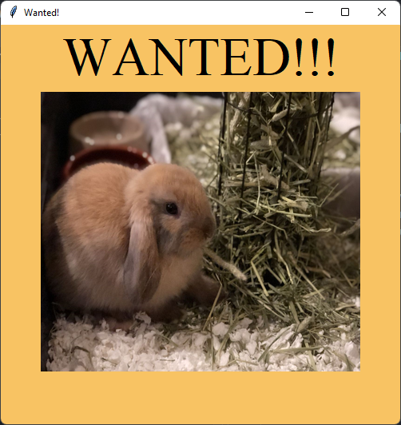

# Python GUI Wanted Poster

## Description:

This project is a simple guide to getting started on creating a GUI application on Python. This project makes use of the [guizero python library](https://lawsie.github.io/guizero/about/).

## How to Run:

1. Fork the Repository
2. Clone the Repository
3. Run the Code in your IDE

## Source Code:

```python
# import widgets from quizero library
from guizero import App, Text, Picture

# create a container widget
app = App(title="Wanted!")

# change background color
app.bg = "#F8C363"

# add a text widget
Hazel = Text(app, "WANTED!!!")
Hazel.text_size = 50
Hazel.font = "Times New Roman"

# add a picture widget
bunny = Picture(app, image="./images/Hazel.jpg")
bunny.resize(400, 350)

# display the gui app
app.display()
```

## GUI Result:



## Online Resources:
* [Guizero](https://lawsie.github.io/guizero/about/)
* [Guizero - Picture](https://lawsie.github.io/guizero/picture/)
* [HTML Color Codes](https://htmlcolorcodes.com/)